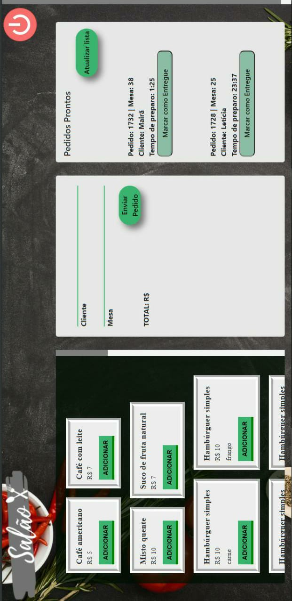

Esse projeto foi realizado durante o Bootcamp da Laboratoria - turma SAP005, iniciando nossos estudos sobre react.

[**Conheça a Cantina Hamburgo :computer:**] (https://cantinahamburgo.netlify.app/)
> Status do Projeto: em andamento :gear:

---

## Índice

- [1. Apresentação do Projeto](#1-apresentação-do-projeto)
  - [1.2 Nome Cantina Hamburgo](#1.1-nome-cantina-hamburgo)
  - [1.3 Conhecendo a interface](#1.1-conhecendo-a-interface)
- [2. Planejamento Ágil](#2-planejamento-agil)
- [3. Desenvolvimento](#4-desenvolvimento)
  - [3.1 Critérios mínimos de aceitação do projeto](#3.1-problema-a-ser-resolvido) 
  - [3.2 Protótipos](#3.4-protótipos)
- [4. Habilidades Desenvolvidas](#4-habilidades-desenvolvidas)  
- [5. Desenvolvedoras](#5-desenvolvedoras)

---

## 1. Apresentação do Projeto :clipboard:

A Cantina Hamburgo é uma aplicação feita para facilitar a rotina laboral de lanchonetes e restaurantes. Somente no Brasil existem, aproximadamente, 01 (um) milhão de negócios consideradores bares, restaurantes e lanchonetes, gerando 450 mil novos empregos por ano, segundo a Associação Brasileira de Bares e Restaurantes (Abrasel).
Ter uma comunicação eficiente entre os trabalhadores da cozinha e aqueles que atendem as mesas é de suma importância para garantir um atendimento de qualidade para os clientes e tranquilidade para os trabalhadores.

### 1.2 Nome Cantina Hamburgo

Hamburgo é o nome de uma cidade portuária localizada ao norte da Alemanha, o seu principal acesso é pelo Mar do Norte através do rio Elba. Pela facilidade de acesso e consequentemente pela crescente relação comercial, entre o final do século XIX e início do século XX, uma iguaria de sua culinária local acabou sendo exportada pelos diversos marinheiros e imigrantes que alí atracavam, conhecida como “bife à moda hamburgo” (hamburger beef), eis que surge o nome de uma das comidas rápidas mais populares do mundo, o hambúrguer, prato principal do cardápio de nosso restaurante.
Cantina por ter se popularizado como um espaço popular, onde se realiza refeições. Geralmente chamam os restaurantes ou lanchonetes de instituições e escolas por este termo.

### 1.3 Conhecendo um pouco da interface

Esta aplicação foi pensada para que o próprio funcionário possa utilizar intuitivamente os recursos disponíveis e que ao mesmo tempo facilite o seu trabalho. Acessando o site da [Cantina Hamburgo](https://cantinahamburgo.netlify.app/), será possível fazer login/registro, dependendo da função que será informada no cadastro, o mesmo será redirecionado para a interface que melhor se adequa a sua rotina. 

**:cocktail: SALÃO**
>No canto esquerdo da interface é possível visualizar todo o cardápio disponível, sendo de fácil leitura e manuseio. No canto superior à esquerda, há um espaço para preencher manualmente o nome e a mesa do cliente. Na parte central-inferior da tela é possivel excluir, alterar quantidade e enviar o pedido que será recebido logo em seguida pela cozinha (um alerta aparecerá na tela, informando que o pedido foi devidamente enviado com sucesso). 
>Após realizar o pedido, no canto inferior direito, é possivel verificar se o pedido já está pronto e o tempo de preparo.

**:woman_cook: COZINHA** 
>A interface é dividida em duas partes (inferior e superior), na parte superior é possível verificar a lista de pedidos que devem ser preparados, ao clicar em "preparar pedido", o mesmo mudará de status.
>Na parte inferior da interface estarão os pedidos em preparo, ao clicar "marcar como prontos", eles sumirão da interface e o funcionário do salão poderá verificar se o pedido está pronto.

---

## 2. Planejamento Ágil :memo:

Utilizou-se a ferramenta _Trello_ para planejar as ideais e organizar as tarefas.
Se quiser saber um pouco mais sobre o planejamento, basta acessar esse [link](https://trello.com/b/Z4uI22ac/cantina-hamburgo).

## 3. Desenvolvimento

### 3.1 Critérios mínimos de aceitação do projeto

### 3.2 Prótipos

O projeto foi desenvolvido utilizando protótipos de baixa fidelidade e no projeto foram utilizadas fotos de alta resolução.

## 4. Habilidades Desenvolvidas :dart:

:pushpin: HTML semântico 
:pushpin: CSS  
:pushpin: Javascript  
:pushpin: Colaboração pelo Github 
:pushpin: Design Sprint 
:pushpin: Experiência do Usuário (UX) 
:pushpin: MVP (Mínimo Produto Viável) 
:pushpin: Manipulação de API 
:pushpin: React.js 
:pushpin: Styled Components

#### Soft Skills

:pushpin: Colaboração 
:pushpin: Trabalho em equipe 
:pushpin: Diálogo entre a dupla 
:pushpin: Manejo do estresse 
:pushpin: Planejamento 
:pushpin: Saber pedir ajuda às colegas e aos mentores

## 5. Desenvolvedoras :computer:

#### :octocat: [**Letícia Brasileiro**](https://github.com/letbrasil) 

#### :octocat: [**Mairã Soares**](https://github.com/MairaSoares) 

---
